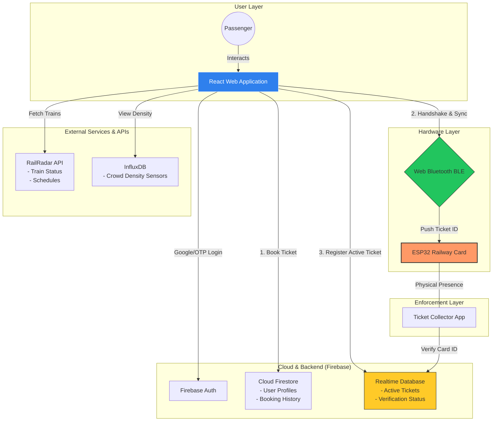

# Traq 🚆 | Next-Gen Smart Railway Ecosystem

[](https://reactjs.org/)
[](https://firebase.google.com/)
[](https://developer.mozilla.org/en-US/docs/Web/API/Web_Bluetooth_API)
[](https://www.influxdata.com/)

**Traq** is a cutting-edge, hardware-integrated railway ecosystem designed to modernize unreserved (General) ticketing. By bridging the gap between digital convenience and physical infrastructure, Traq replaces traditional paper tickets with a smart, Bluetooth-enabled **Railway Card** (ESP32-based).

---

## 🌟 Key Features

- **Smart Railway Card:** A portable ESP32-based hardware device that stores your ticket ID securely.
- **BLE Syncing:** Seamlessly transfer tickets from your browser to your physical card using Web Bluetooth (BLE).
- **Live Crowd Density:** Real-time visualization of coach occupancy using InfluxDB sensor data.
- **RailRadar Integration:** Live train tracking, status updates, and schedule management.
- **Dual-Write Verification:** Simultaneous synchronization of ticket data across the physical card and Firebase Realtime Database for instant verification by authorities.

## 🛠️ The Problem It Solves

1.  **Queue & Paper Waste:** Eliminates long UTS counter queues and the need for thermal paper tickets.
2.  **Offline Verification:** Unlike QR codes, the Railway Card stores the ticket ID locally. Verification works in tunnels, tracks, and remote stations with zero connectivity.
3.  **Dynamic Crowd Insight:** Passengers can see coach density *before* boarding, enabling better social distancing and comfort.
4.  **Resilience:** A durable smart card replaces the easily lost or damaged paper tickets.

---

## 🏗️ System Architecture



---

## 🚀 How It Works

### 1. Discovery & Planning
Users search for trains using the **RailRadar API**. They can check the **Live Crowd Density** (powered by **InfluxDB**) to see which coaches have available space.

### 2. Digital Booking
Tickets are booked through the React frontend. Upon payment/confirmation, a record is created in **Cloud Firestore** for historical tracking.

### 3. BLE Handshake & Sync
The web app establishes a BLE connection with the **RAILCARD** (ESP32). A 2-step protocol is followed:
-   **Handshake:** The app writes a permanent ID to the card for authentication.
-   **Push:** The 12-char Ticket ID is pushed to the card's characteristic.

### 4. Global Validation
Simultaneously, the app writes the Ticket ID and route to the **Firebase Realtime Database (RTDB)** with `verified: false`. When a Ticket Collector taps the card, their app queries the RTDB to validate the ticket's legitimacy instantly.

---

## 💻 Tech Stack

-   **Frontend:** React.js, Tailwind CSS, Lucide Icons.
-   **Backend:** Firebase (Authentication, Firestore, Realtime Database).
-   **IoT/Hardware:** ESP32 Microcontroller, Web Bluetooth API (BLE).
-   **Time-Series:** InfluxDB (Real-time sensor telemetry).
-   **API:** RailRadar (Live train tracking).

---

## ⚙️ Getting Started

1.  **Clone the Repo:**
    ```bash
    git clone https://github.com/Sangeeth62880/Traq.git
    cd Traq
    ```
2.  **Install Dependencies:**
    ```bash
    npm install
    ```
3.  **Environment Setup:**
    Create a `.env` file with your Firebase, InfluxDB, and RailRadar credentials.
4.  **Run Locally:**
    ```bash
    npm run dev
    ```

---

## 🗺️ Roadmap
- [ ] NFC Integration for tap-to-verify.
- [ ] Mobile App (Flutter) for TTE verification.
- [ ] AI-based crowd prediction models.
- [ ] Multi-language support for regional travelers.

---
*Built with ❤️ for the future of Indian Railways.*
