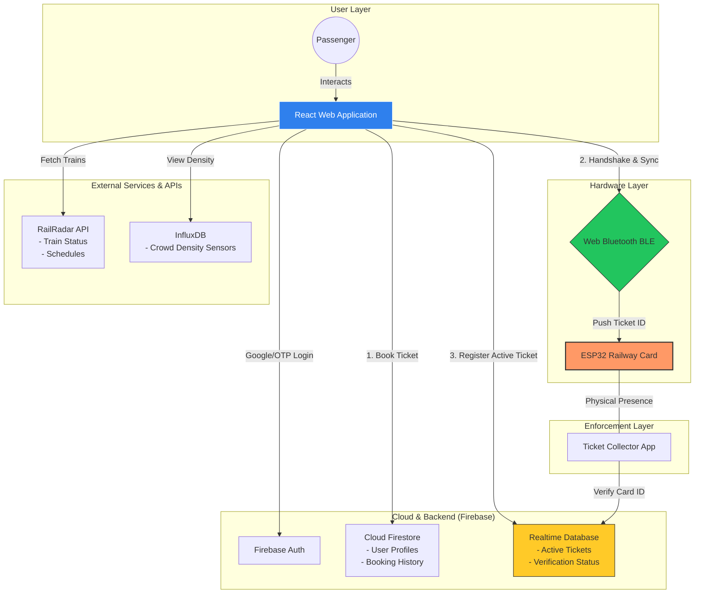

# Traq System Architecture

## Component Breakdown

### 1. React Web Application (Frontend)
- **State Management:** Handles journey selection, train searching, and booking flows.
- **BLE Service:** Manages the browser-to-hardware communication lifecycle (Scanning -> Connecting -> Handshake -> Data Push).

### 2. ESP32 Railway Card (Edge Hardware)
- **Role:** Portable bearer of the digital ticket.
- **Communication:** Passive BLE Peripheral that accepts writes to specific characteristics after a 2-step verification handshake.

### 3. Firebase Architecture
- **Firestore:** Optimized for document-based retrieval of long-term booking history and user metadata.
- **Realtime Database (RTDB):** Used as a high-speed lock/verification table. When a ticket is synced to a card, its ID and route are mirrored here with `verified: false`.

### 4. Logic & Data Flow
1. **Discovery:** User searches for a train (RailRadar) and checks which coach is empty (InfluxDB).
2. **Transaction:** User books a general ticket (Firestore).
3. **Physical Sync:** The Web App establishes a BLE link, performs a handshake with the ESP32, and pushes the Ticket ID.
4. **Validation:** Simultaneously, the Web App updates the RTDB to signal that a specific Ticket ID is now "Live" on a physical card for the Ticket Collector (TTE) to verify.
